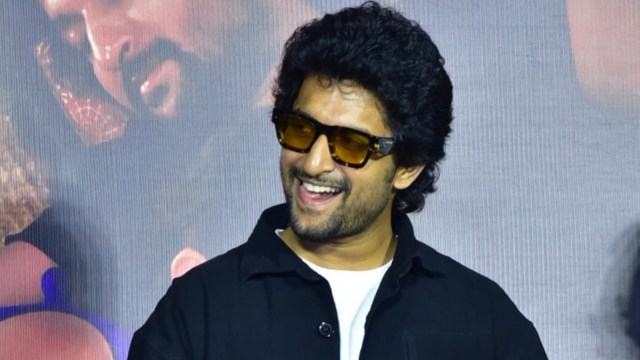

## Tharun Guda
### EEGA
My all-time favorite movie is "Eega" by S. S. Rajamouli, released in the year 2012. Well, this is a different and strange story in which a man named Nani gets reincarnated as a housefly to take revenge on the villain, Sudeep, who killed him out of jealousy. What impresses me most about this movie is its sheer ingenuity: turning an ordinary housefly into a vengeful hero with such an emotional connection to the audience is pure brilliance. Added to that, the movie has stunning visual effects and a thrilling, hilarious way in which the fly outsmarts a powerful antagonist. Music by M.M. Keeravani gives the film an extra layer of emotion, and the performances by Nani, Sudeep, and Samantha raise the movie to a whole new level. Rarely does one find a movie with action, comedy, and emotion mixed in such a proportion that it makes the movie unforgettable for me.

